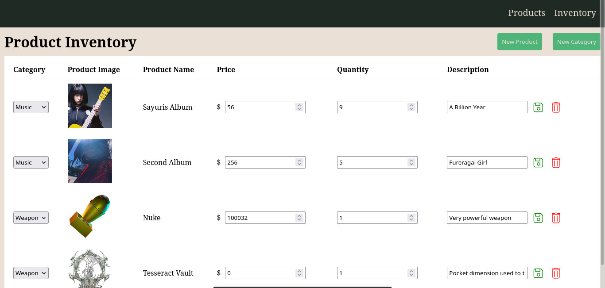
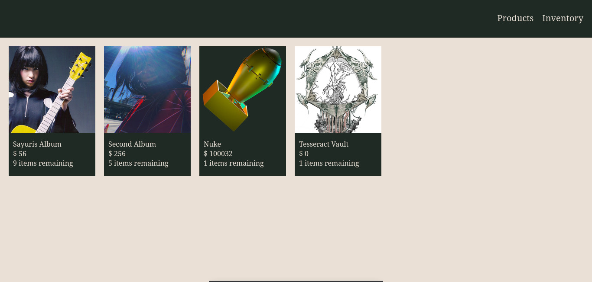

# Inventory Application

This project consists of an inventory management system using Express, EJS and PostgreSQL

Skill demonstrated
 - using Express to create the backend 
 - using EJS to render the page from the backend
 - using PostgreSQL as the database
 - using an env file to store database information 

Preview:

Inventory

Product Page

